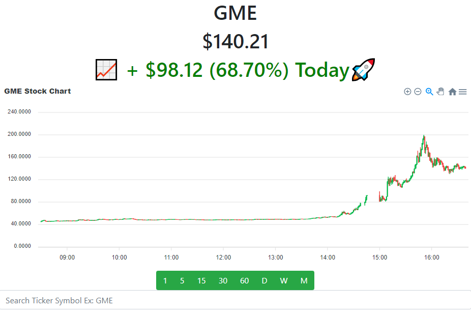

Stock Watcher is a website that allows you to see realtime trading prices and candlestick data on any stock.

Stock Watcher is made using:

React is used to create the responsive user interface

Reactstrap is used to easily implement aesthetic components in React

The Finnhub Stock API is used to provide realtime stock data

Websocket is used to get realtime trade data from the Finnhub Stock API

ApexCharts.js is an open source chart library that is used to easily create candlestick charts based on the price data that is pulled from the Finnhub Stock API
